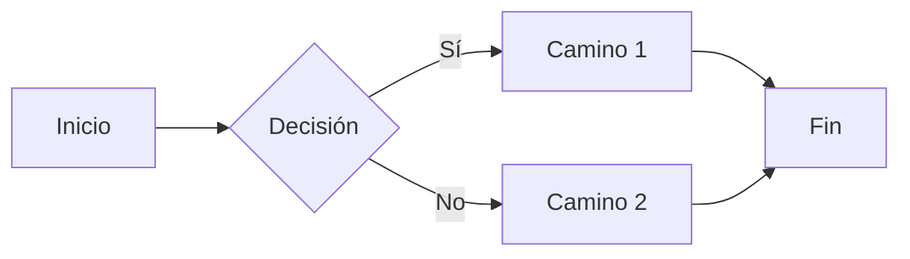

# :RiMarkdownFill: Guía completa de Markdown en Obsidian

¡Bienvenido(a) a tu primera aventura con **Markdown** en **Obsidian**! En esta guía encontrarás una explicación clara y práctica de las principales características de Markdown que podrás utilizar dentro de Obsidian para crear, organizar y enlazar tus notas de forma efectiva.

---
## ¿Qué es Markdown y por qué usarlo en Obsidian?

Markdown es un lenguaje de marcado ligero y sencillo que permite dar formato a texto plano sin necesidad de aprender un sistema complejo. **Obsidian** aprovecha la flexibilidad y ligereza de Markdown para facilitarte la creación y gestión de tus notas y apuntes, ofreciendo funciones como:

1. **Enlaces internos**: Conectar tus notas entre sí con `[[Títulos de notas]]`.
2. **Visualización en tiempo real**: Obsidian dispone de un **panel de vista previa** que muestra tu contenido formateado.
3. **Potencia y simplicidad**: Con pocos caracteres, puedes dar estilo a tus textos, incrustar imágenes y diagramas, e incluso crear tablas.

> [!TIP] **Consejo para principiantes**  
> Una de las grandes ventajas de Obsidian es que todo tu contenido se guarda en archivos Markdown individuales, lo que garantiza la portabilidad y facilidad de copia de seguridad de tus notas.

---

## 1. Fundamentos de Markdown en Obsidian

### 1.1 Encabezados (Headings)

Los encabezados o títulos te permiten estructurar tu nota en secciones. Se utilizan símbolos de número `#` al inicio de la línea.

```markdown
# Encabezado de nivel 1 (H1)
## Encabezado de nivel 2 (H2)
### Encabezado de nivel 3 (H3)
#### Encabezado de nivel 4 (H4)
```

En Obsidian, estos encabezados son cruciales para:

- Organizar el contenido.
- Crear índices o tablas de contenido de forma automática (usando plugins o funciones propias de Obsidian).
- Facilitar la navegación dentro de la nota.

### 1.2 Énfasis de texto: **negrita** e _itálica_

Utiliza `*` o `_` para dar énfasis a tus palabras.

```markdown
**Este texto está en negrita**  
*Este texto está en itálica*  

__También puedo usar dobles guiones para negrita__  
_Este es otro modo de escribir en itálica_

***Puedes escribir en negritas e itálicas a la vez***
```

### 1.3 Listas

Existen dos tipos principales de listas:

- **Listas no ordenadas** (con viñetas)
    
    ```markdown
    - Elemento A
      - Sub-elemento A1
    - Elemento B
    - Elemento C
    ```
    
- **Listas ordenadas** (numeradas)
    
    ```markdown
    1. Primer elemento
    2. Segundo elemento
    3. Tercer elemento
    ```
    

En Obsidian, las listas ayudan a organizar tareas, ideas o pasos de un proceso.

> [!TIP] **Listas de tareas (task lists)**  
> Si quieres crear casillas de verificación, usa `- [ ] Tarea por hacer`, `- [x] Tarea completada`.
> 
> ```markdown
> - [ ] Pendiente
> - [x] Hecho
> ```

### 1.4 Enlaces y referencias internas

#### 1.4.1 Enlaces a otras notas de Obsidian

La característica principal de Obsidian es la capacidad de enlazar notas dentro de tu bóveda:

```markdown
[[Nombre de otra nota]]
```

- Escribe `[[` y Obsidian te sugerirá notas existentes.
- Puedes crear una nota nueva simplemente enlazándola a un nombre que aún no exista.

#### 1.4.2 Enlaces externos

Si quieres enlazar a páginas web u otros recursos en línea:

```markdown
[Texto del enlace](https://direccion.com)
```

### 1.5 Divisores (Horizontal rules)

Para separar secciones o resaltar partes de tu nota, utiliza tres o más guiones:

```markdown
---
```

Esto dibujará una línea horizontal que sirve como separador visual.

---

## 2. Elementos enriquecidos en Markdown

### 2.1 Imágenes

Puedes **incrustar imágenes** tanto locales (guardadas en tu bóveda) como externas.

- Imagen externa:
    
    ```markdown
    
    ```
    
- Imagen local (dentro de tu bóveda):
    
    ```markdown
    ![[NombreImagen.png]]
    ```
    

> [!TIP] **Inserta tus capturas de pantalla** para explicar procesos o recordatorios visuales.

### 2.2 Bloques de código y resaltar sintaxis

Para mostrar código o texto con formato especial:

- **Una sola línea** de código se enmarca entre comillas invertidas:  
    `` `código` ``
- **Bloques de código** extensos se escriben con tres comillas invertidas:

````markdown
```python
def funcion_ejemplo():
    print("Hola, Obsidian")
```
````

> [!INFO]
> Obsidian suele ofrecer **resaltado de sintaxis** para muchos lenguajes en la vista previa.

### 2.3 Tablas

Las tablas en Markdown se crean usando tuberías `|` y guiones `-`:

```markdown
| Columna 1 | Columna 2 | Columna 3 |
| --------- | --------- | --------- |
| Dato A1   | Dato A2   | Dato A3   |
| Dato B1   | Dato B2   | Dato B3   |
````

Esto genera una estructura de tabla que Obsidian muestra con formato.

### 2.4 Bloques de cita (Blockquotes)

Para resaltar citas o bloques de texto especiales:

```markdown
> Este es un bloque de cita.
> Puedes escribir varias líneas aquí.
```

---

## 3. Callouts y resaltados visuales

Obsidian ofrece callouts para resaltar información importante:

```markdown
> [!TIP]
> Aquí puedes brindar un consejo para tu lector.

> [!WARNING]
> Este es un mensaje de advertencia o precaución importante.
```

Existen varios tipos de callouts como `TIP`, `INFO`, `WARNING`, `NOTE`, `IMPORTANT` y muchos más. Los callouts hacen la información más atractiva y fácil de localizar dentro de tu nota.

---

## 4. Diagramas con Mermaid

Una de las funciones avanzadas que Obsidian y Markdown soportan es la inclusión de **diagramas Mermaid**.  
Para utilizarlo, crea un bloque de código con el lenguaje `mermaid`:

````markdown

````

> [!TIP]
> **Diagramas útiles**  
> Con Mermaid puedes crear **diagramas de flujo**, **gráficos de Gantt**, **diagramas de secuencia**, entre otros. Te resultará muy útil para mapear procesos o esquemas mentales dentro de Obsidian.

---

## 5. Trucos específicos de Markdown en Obsidian

### 5.1 Embed (incrustar) notas

Obsidian permite incrustar el contenido de una nota dentro de otra:

```markdown
![[Nombre de la nota que quieres incrustar]]
````

Esto mostrará el texto completo (o una parte específica de la nota, si usas referencias de bloque) dentro de tu nota actual.

### 5.2 Referencias de bloque

Cada párrafo o elemento en Markdown puede referenciarse con `^` para citarlo en otra nota.

```markdown
Este es un párrafo que quiero referenciar. ^refUnico
```

Luego, en otra nota:

```markdown
![[NombreDeLaNota#^refUnico]]
```

Así, incrustarás solo ese bloque específico.

### 5.3 Resaltado (Highlight)

Para resaltar texto dentro de una nota, Obsidian usa: 

```markdown
==Este texto aparecerá resaltado en amarillo==
```

---

## 6. Consejos de organización y mejores prácticas

1. **Nombra tus archivos de forma clara**:  
    Usa nombres descriptivos para encontrar tus notas fácilmente y enlazarlas con rapidez.
2. **Estructura jerárquica con carpetas o etiquetas**:  
    Aunque Obsidian te permite funcionar sin una estructura fija, es útil categorizar tus notas por temas o áreas.
3. **Aprovecha los enlaces** para crear un **mapa** de tu conocimiento:  
    Conecta tus notas para formar una red de información que puedas explorar visualmente.
4. **Usa callouts y divisores** para hacer tus notas más escaneables.
5. **Practica con proyectos pequeños** antes de volverte demasiado complejo. ¡Ensayo y error es parte del proceso!

---

## 7. Recursos adicionales

> [!INFO]  
> **¿Quieres seguir aprendiendo?**
> 
> - **Documentación oficial de Obsidian (en inglés)**: Disponible en la sección de _Help_ dentro de la aplicación.
> - **Cheat Sheet de Markdown**: Existen múltiples hojas de referencia rápidas en la web, como la de [Markdown Here](https://github.com/adam-p/markdown-here/wiki/Markdown-Cheatsheet).
> - **Comunidad de Obsidian**: Participa en foros y comunidades (oficiales o en Discord/Reddit) para resolver dudas y compartir tus flujos de trabajo.

---

## 8. Conclusión

Markdown es la columna vertebral de Obsidian: con pocos caracteres especiales, puedes estructurar, enlazar y enriquecer tus notas para que sean claras y atractivas. Empieza con los **encabezados**, practica con **listas** y **enlaces**, y poco a poco añade **imágenes**, **callouts** y **diagramas** para mejorar tu flujo de trabajo.

¡Disfruta explorando tu bóveda con la libertad que te brinda la sintaxis de Markdown en Obsidian!

---

¡Felicidades! Con esta guía tienes las bases para convertirte en un experto(a) en **Markdown dentro de Obsidian**. Disfruta la flexibilidad de este sistema y mantén tus ideas organizadas y accesibles. ¡Feliz escritura y descubrimiento!