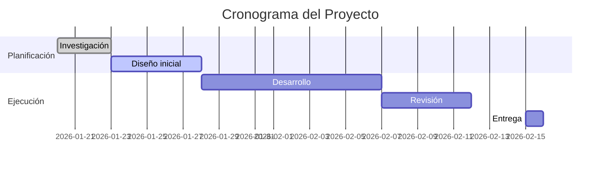

<%*
const defaultName = "Doc_Maestro";
await tp.file.rename(defaultName);
%>


---
# ¡Bienvenidas, bienvenidos, bienvenides al Equipo de _<%* const title = await tp.system.prompt('Ingrese el nombre del proyecto:'); tR += title; %>_!

---
## :FasCircleInfo: Información básica

- g! **Repositorio**:  **[GitHub del proyecto](<%* const defaultGithub = 'https://github.com/socialdataibero'; const github = await tp.system.prompt('Ingrese el enlace del proyecto en GitHub:', defaultGithub); tR += github; %>)**
- dr! **Google drive**:  **[Carpeta drive del proyecto](<%* const defaultDrive = 'https://drive.google.com'; const drive = await tp.system.prompt('Ingrese el enlace para el Google Drive:', defaultDrive); tR += drive; %>)**)
- p! **Reuniones**:  **[Zoom Social Data](<%* const defaultLink = 'https://ibero.zoom.us/j/94626240925'; const link = await tp.system.prompt('Ingrese el enlace para las reuniones virtuales del proyecto:', defaultLink); tR += link; %>)**)
- log! **Fecha y hora de reunión semanal**: _<%* const horario = await tp.system.prompt('Ingrese el horario predefinido de la reunión semanal', 'Ej. Martes 6 pm'); tR += horario; %>_

---
## :RiTeamFill: Equipo

> [!important]- Importante - **Leer antes de continuar** 
> 
> 1. _Admin_: Lee las [instrucciones de administrador](07_Docs/instrucciones_admin) para completar la configuración del proyecto.
> 2. _Participante_: Regístrate como integrante del proyecto. Sigue las [instrucciones de registro](07_Docs/registro_integrante).

>[!team]+ Conoce a tus compañeros
>Accede al [Tablero de Integrantes](00_Admin/tablero_integrantes.md) donde encontrarás la información de todos los participantes del proyecto. 
>
>Para conocer más sobre ellos, puedes acceder a su ficha personalizada desde la carpeta `05_Integrantes` o haciendo clic dentro del tablero en su nombre. 

---
## :LiBookHeart: Código de conducta

> [!cond]+ Antes de seguir 
> ¡Lee el [código de conducta](07_Docs/codigo_conducta.md)! Es importante para asegurar una buena convivencia en nuestro entorno de trabajo :LiHeartHandshake:.

---
## :RiProjectorFill: Acerca del proyecto

> [!summary]- Resumen  
>
> <%* let resumen = await tp.system.prompt("Por favor, escribe el resumen del proyecto:", "Este es un resumen predeterminado del proyecto."); if (!resumen || resumen.trim() === "") { tR += "Este es un resumen predeterminado del proyecto."; } else { tR += resumen; } %>

> [!important]- Objetivo general 
>  
> <%* let objetivo = await tp.system.prompt("Por favor, escribe el objetivo general del proyecto:", "Este es un objetivo general predeterminado."); if (!objetivo || objetivo.trim() === "") {     tR += "Este es un objetivo general predeterminado."; } else {     tR += objetivo; } %>

---
## :FasCalendarDay: Cronograma general



---

## :LiWorkflow: Flujo de trabajo

La carpeta principal, **`01_Proyecto`**, concentra toda la información del proyecto organizada en tres pilares fundamentales:

- **Investigación** (`Bibliografia` y `Revision_Literatura`)
- **Redacción** (`Fichas_Tecnicas`)
- **Acuerdos de reuniones** (`Reuniones`)

Para cada pilar, existe una plantilla específica destinada a normalizar la estructura de las notas y facilitar el manejo de la información. Puedes consultar el uso detallado de cada plantilla en los siguientes enlaces:

> [!orange]- Enlaces a plantillas
> 1. **Bibliografía**
>    - Clasifica la información de las referencias según el [código de color](07_Docs/codigo_colores).
>    - Utiliza la plantilla [anotaciones_referencia](07_Docs/anotaciones_referencia.md) para extraer y organizar todas las anotaciones de los archivos `.pdf`.
>    - **Revisión de literatura**: crea una ficha de revisión con la plantilla [ficha_revisión_literatura](07_Docs/ficha_revision_literatura.md) para sintetizar tesis, objetivos, conceptos, autores clave, citas y relevancia para la investigación. La ficha permite controlar dinámicamente **estado** y **relevancia** (`status`, `priority`) y trae campos preconfigurados para **citas APA** y **vínculo a Zotero**.
> 2. **Fichas técnicas**
>    - Usa la información previamente clasificada y revisada para redactar fichas técnicas con la plantilla [fichas_tecnicas](07_Docs/fichas_tecnicas). 
> 3. **Reuniones**
>    - Idealmente, se lleva a cabo una reunión semanal para presentar avances y asignar nuevas tareas o compromisos, documentados en la plantilla [reuniones](07_Docs/reuniones_doc.md).

Basado en esto, el flujo sugerido es el siguiente:

> [!tip]- Flujo sugerido
> 1. **Lectura y clasificación**
>    - Leer las referencias en Zotero y clasificar la información en el `.pdf` de acuerdo con el [código de color](07_Docs/codigo_colores.md).
> 2. **Creación de anotaciones**
>    - Generar una nota utilizando la plantilla de anotaciones y vaciar en ella la información destacada durante la lectura del `.pdf`.
> 3. **Revisión de literatura (nueva)**
>    - Para cada referencia clave, crear una **ficha de revisión** con la plantilla `ficha_revision_literatura`. Completar tesis principal, objetivos/preguntas, conceptos/categorías, autores retomados, conclusiones, relación con el proyecto y **citas textuales en rosa** importadas desde Zotero. Controlar **estatus** y **prioridad** con los selectores integrados. :contentReference[oaicite:3]{index=3}
> 4. **Redacción de fichas técnicas**
>    - Tras la revisión, trasladar los hallazgos y definiciones consolidadas a una **ficha técnica** para su desarrollo, citando en formato parentético o bibliográfico según corresponda. :contentReference[oaicite:4]{index=4}
> 5. **Reunión semanal**
>    - Revisar el progreso, asignar nuevas tareas y registrar los acuerdos alcanzados en la plantilla correspondiente.

> [!diagram]- **Diagrama del flujo de trabajo**
> ```mermaid
> flowchart TB
> 
>     %% Definición de clases
>     classDef invClass fill:#CCE5FF,stroke:#5BC0DE,color:#000,stroke-width:2px
>     classDef revClass fill:#E8D9FF,stroke:#8E63FF,color:#000,stroke-width:2px
>     classDef ftClass fill:#DFF0D8,stroke:#5CB85C,color:#000,stroke-width:2px
>     classDef rClass fill:#FFEFE5,stroke:#FAAD62,color:#000,stroke-width:2px
>     
>     linkStyle default stroke:#999999,stroke-width:1.5px,color:#333,opacity:0.8
> 
>     %% Subgrafo de Investigación
>     subgraph subInv[Investigación]
>         A([Zotero]) --> B(Leer y clasificar PDF<br>según código de color)
>         B --> C(Crear nota de anotaciones<br>con plantilla predefinida)
>     end
> 
>     %% Subgrafo de Revisión de literatura (nuevo)
>     subgraph subRev[Revisión de literatura]
>         C --> R1(Crear ficha de revisión<br>con 'ficha_revision_literatura')
>         R1 --> R2(Sintetizar tesis, objetivos,<br>conceptos, autores, citas)
>         R2 --> R3(Definir relevancia y estatus<br>de la referencia)
>     end
> 
>     %% Subgrafo de Fichas Técnicas
>     subgraph subFichas[Fichas Técnicas]
>         R3 --> D(Vaciar resultados consolidados<br>en fichas técnicas)
>         D --> E(Refinar / estructurar y analizar la información)
>     end
> 
>     %% Subgrafo de Reuniones Semanales
>     subgraph subReun[Reuniones Semanales]
>         E --> F(Reunión para revisar avances<br>y asignar tareas)
>         F --> G(Registrar acuerdos<br>en plantilla de reuniones)
>         G --> H(Actualizar tareas<br>y compromisos)
>     end
> 
>     %% Retroalimentación al inicio del flujo
>     H --> A
> 
>     %% Clases
>     class A,B,C invClass
>     class R1,R2,R3 revClass
>     class D,E ftClass
>     class F,G,H rClass
> 
>     %% Estilos
>     style subInv fill:#EAF2FD,stroke:#5BC0DE,stroke-width:2px,stroke-dasharray: 5 5
>     style subRev fill:#F2ECFF,stroke:#8E63FF,stroke-width:2px,stroke-dasharray: 5 5
>     style subFichas fill:#F0FAF0,stroke:#5CB85C,stroke-width:2px,stroke-dasharray: 5 5
>     style subReun fill:#FDF1EC,stroke:#FAAD62,stroke-width:2px,stroke-dasharray: 5 5
> ```
>
> Este flujo incorpora una etapa explícita de **revisión** que estandariza el análisis por referencia y mejora la trazabilidad hacia las fichas técnicas y las decisiones del proyecto. 

Este flujo de trabajo asegura una gestión ordenada de la información, facilita la consulta de avances y promueve la colaboración efectiva a lo largo de todo el proyecto.

---
## :RiToolsFill: Herramientas para llenado de notas

Durante la redacción de tus notas (fichas técnicas fundamentalmente) puedes requerir distintas herramientas. Consulta los siguientes manuales para saber cómo utilizar estos instrumentos:

> [!purple]- **Rereferencias**
> Consulta [¿Cómo citar?](07_Docs/referencias.md) para aprender sobre el manejo de referencias en el proyecto.

> [!words]+ **Glosario**
> Consulta la documentación del [glosario](07_Docs/glosario_doc.md) para saber cómo utilizarlo en el flujo de trabajo. 
