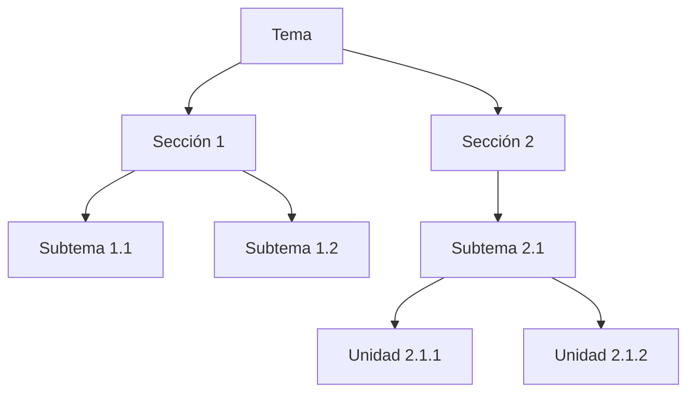
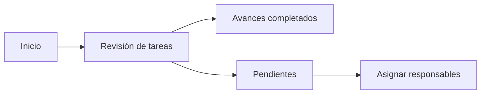

# :LiClipboardCopy: Responsabilidades principales

---
## :FasRegistered: Registro como Integrante

- **Acción:** Regístrate como integrante del proyecto. 
- **Instrucciones:** Sigue las [instrucciones de registro](app://obsidian.md/07_Docs/registro_integrante).

⚠️ **Nota:** Asegúrate de completar este paso antes de continuar con las demás tareas.

---
## :LiCalendarCog: Creación del Cronograma General

- **Acción:** Diseña un cronograma general con las fases principales del proyecto utilizando `mermaid`. 
- **Ubicación:** Sección `Cronograma General` en el documento maestro. 
- **Referencia:** Se incluye un ejemplo en la misma sección para guiarte.

📌 **¿No conoces la sintaxis de `mermaid`?** Puedes utilizar ChatGPT u otras herramientas similares para generarlo. 

📎También puedes usar plugins como `full calendar` o `markwhen` para crear cronogramas más sofisticados. 

---
## :RiOrganizationChart: Generación de la Estructura Jerárquica del Tema

- **Acción:** Puedes generar una estructura jerárquica del tema del proyecto para su organización en fichas técnicas. La idea es dividir el tema en pequeñas unidades de investigación. 
- **Pasos:** 
	1. Crea una nueva nota en la raíz del proyecto.
	2. Asigna un nombre con el formato: `estructura_{tu_tema}`.
	3. Presiona el comando `CTRL + ALT + E`.
	4. Se insertará automáticamente una plantilla de estructura y se te pedirá ingresar el nombre del tema.
	5. Diseña la estructura basada en nodos jerárquicos del tema rellenando la plantilla insertada.
	6. Visualiza la estructura en un mapa con `ALT + M`.

### 📌 Ejemplo de Estructura Jerárquica 

---

## :LiFolderPen: Significado del Subrayado en Referencias

- **Acción:** Asigna un significado al subrayado por colores de información dentro de Zotero. 
- **Tarea:** Completa los campos dentro de la tabla [Código de colores](07_Docs/codigo_colores.md), para clasificar la información de las referencias consultadas.

---

# 🎛️ Vista de Administrador

📌 **Ubicación:** Carpeta `00_Admin` 
📌 **Funcionalidad:** Consulta los tableros de avances. 
📌 **Configuración:** Se incluyen vistas preconfiguradas, pero puedes modificarlas según tus necesidades.

✅ **Ejemplo de Tablero de Avances:**

---
# :FasHeadSideVirus: Opciones de desarrollador

Puedes adaptar todas las plantillas y tableros a tus necesidades, para ello debes tener conocimiento en los plugins principales usados:

- [Dataview](https://blacksmithgu.github.io/obsidian-dataview/)
- [Meta-Bind](https://www.moritzjung.dev/obsidian-meta-bind-plugin-docs/)
- [Templater](https://silentvoid13.github.io/Templater/introduction.html)
- [Task](https://publish.obsidian.md/tasks/Introduction)

- ! Para modificar **Plantillas** ingresa a la carpeta `01_Recursos/Plantillas`
- ava! Para modificar **Tableros** ingresa a la carpeta `00_Admin`

---

📌 **Recuerda:** Mantén actualizado tu progreso y consulta regularmente los tableros para optimizar la gestión del proyecto. 🚀